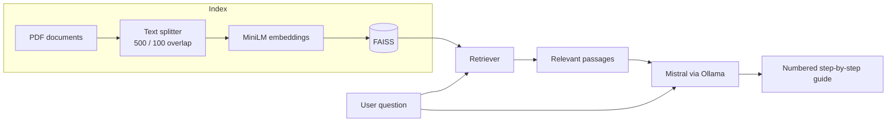

<div align="center">

# PolicyGPT

**Turn dense government documents into clear, step-by-step guides.**

A local RAG assistant that answers questions about Turkish public procedures (residence registration, social security, citizenship and taxes) using the official documents as its source.


</div>

---

## Why

Official procedures are documented in long PDFs written in legal language. Most people only want to know *what to do next*. PolicyGPT reads those documents for you and answers with a short, numbered list of steps, grounded in the source text rather than the model's guesses.

## How it works



1. The PDFs in `data/` are split into overlapping chunks and embedded with `sentence-transformers/all-MiniLM-L6-v2`.
2. Chunks are indexed in a FAISS vector store.
3. For each question, the most relevant passages are retrieved and passed to **Mistral** running locally through **Ollama**.
4. The model is instructed to answer only in Turkish, as short, actionable, numbered steps.

Everything runs on your machine. No document or question is sent to an external API.

## Demo

| Residence certificate | Social security record |
|---|---|
|  |  |
| **Citizenship application** | **Tax debt inquiry** |
|  |  |

## Getting started

**Requirements:** Python 3.10+ and [Ollama](https://ollama.com).

```bash
# 1. Pull the model
ollama pull mistral

# 2. Clone and install
git clone https://github.com/omeraydin00/PolicyGPT.git
cd PolicyGPT/PolicyGPT
python -m venv venv
source venv/bin/activate        # Windows: venv\Scripts\activate
pip install -r requirements.txt

# 3. Run
python app.py
```

Open **http://127.0.0.1:5000** and ask a question such as *"İkametgah belgesi nasıl alınır?"*.

To cover a new topic, drop its PDF into `data/` and add the path to `pdf_files` in `rag_engine.py`.

## Project structure

```
PolicyGPT/
├── app.py            # Flask app: form input and rendering
├── rag_engine.py     # Loading, chunking, embedding, retrieval and generation
├── requirements.txt
├── data/             # Source PDFs (residence, social security, citizenship, tax)
├── static/style.css
└── templates/index.html
```

## Limitations

- The vector index is rebuilt on every question. Persisting it to disk would make answers much faster.
- Answers are only as current as the PDFs in `data/`. Always confirm critical steps on the official portal.

---

<div align="center">
Built by <a href="https://github.com/omeraydin00">Ömer Faruk Aydın</a> as a deep learning course project.
</div>
